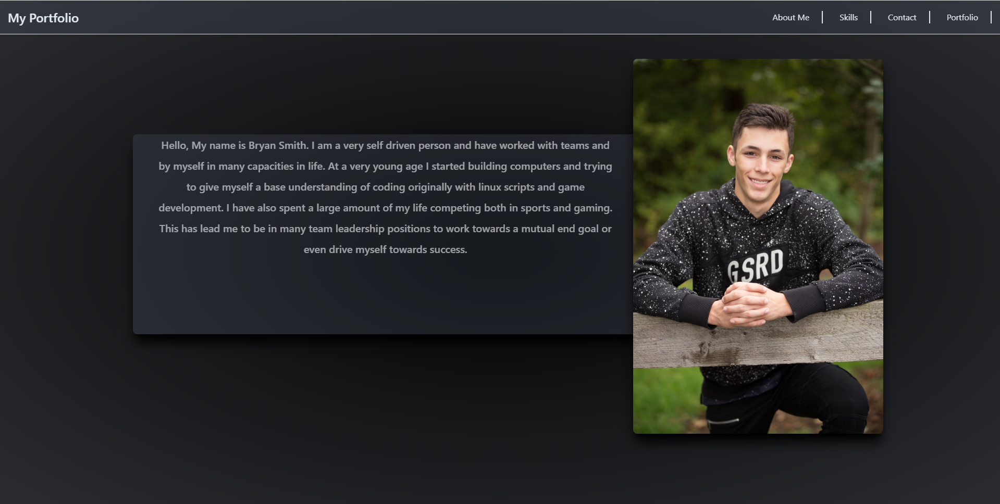

# React Portfolio
  
  
  ## Description
  
  This is my personal portfolio made primarily with react and tailwind.
  
  ## Table of Contents 
  
  * [Installation](#installation)
  
  * [Questions](#questions)
  
  ## Installation
  
  To install necessary dependencies, run the following command:
  
  ```
  run npm install inside of the portfolio folder to install all dependencies
  ```

  # Example

  

  
  ## Questions
  
  If you have any questions about the repo, open an issue or contact me directly at smitbry17@gmail.com. You can find more of my work at [smitbry17](https://github.com/smitbry17/).